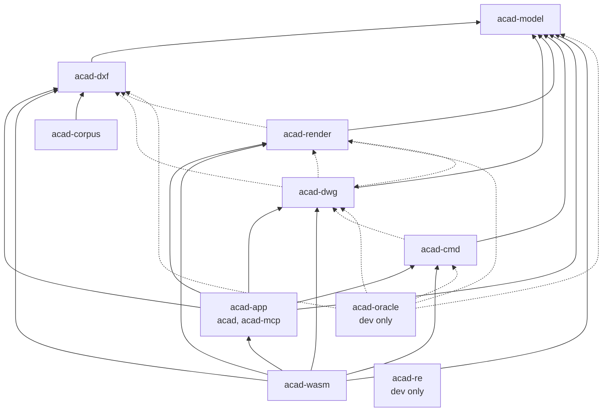
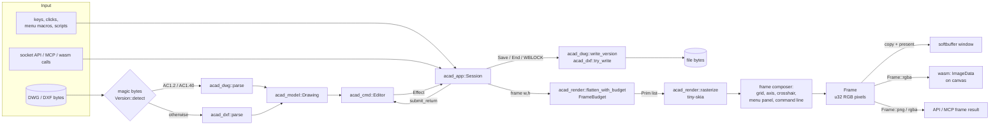
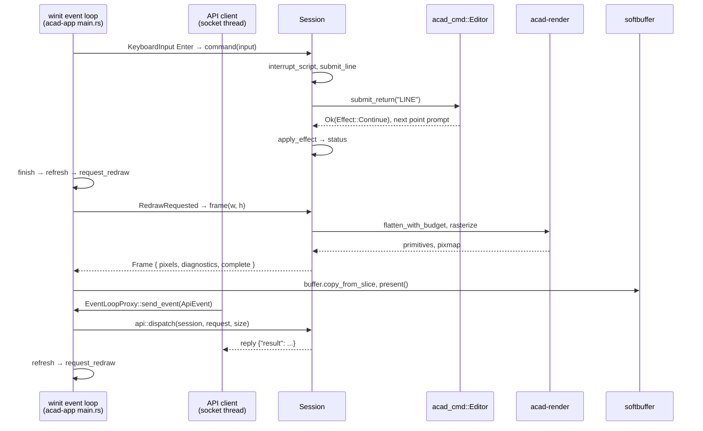
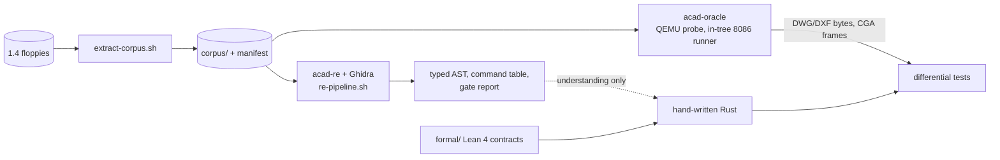

# AutoCADED

AutoCAD + **ED**, for Dmytro Yemelianov (Emelyanov). AutoCAD is a trademark of
Autodesk, Inc.

Rebuilding **AutoCAD 1.4** (1983, MS-DOS) as a native Rust application for the
original 2D drafting workflow: commands, drawing semantics, and files in a modern
window.

The original is the oracle. "Is this command right?" is answered by differential
test against the real `ACAD.EXE`, not by judgement. 1983 policy lives in the
codecs and the command layer; `acad-model` is written to grow toward 3D, modern
UX and an extended entity model on top of the verified-compatible core.

Design: [`docs/superpowers/specs/2026-09-28-autocad-14-rust-design.md`](docs/superpowers/specs/2026-09-28-autocad-14-rust-design.md)

**Contents:** [Finish line](#finish-line) ·
[Status](#status) ·
[Quick start](#quick-start) ·
[Architecture](#architecture) ·
[Crates](#crates) ·
[Performance and profiling](#performance-and-profiling) ·
[Design considerations](#design-considerations) ·
[The corpus](#the-corpus) ·
[Reverse engineering and verification](#reverse-engineering-and-verification) ·
[Scope](#scope) ·
[Contributing and CI](#contributing-and-ci)

## Finish line

The project is complete when the native app can open and render every drawing
in the AutoCAD 1.4 sample corpus; create, edit, and save supported 2D drawings
with keyboard commands and mouse-based point placement and selection; and
exchange those drawings with the original under QEMU. Every software-only 2D
command in the recovered 57-command table must be implemented and
differentially checked against the original; the plotter and digitizer
commands are classified as hardware commands.

## Status

| | Milestone | |
|---|---|---|
| ① | DXF codec, corpus integrity, first render | **done** |
| ② | Ghidra overlay loader, dual AST export, `acad-re` | **done** |
| ③ | Oracle harness | in progress: partial 8086/DOS/BIOS core; in-tree empty, LINE, POINT, CIRCLE, ARC, SOLID, and TRACE DWGs match QEMU byte for byte, as does a LINE CGA frame |
| ④ | DWG codec — `AC1.40`, then `AC1.2` | all 21 corpus drawings read; both writers open in the original; SUBDIV's AC1.2 viewport matches pixel-for-pixel |
| ⑤ | Command loop | in progress: all 54 software commands recognized; behavior and differential coverage tracked per command |

- **Commands.** The recovered table contains 57 names: 54 software commands,
  all recognized, and the hardware commands `TABLET`, `PLOT` and `QPLOT`. Each
  command's prompts, effects and file behavior are verified against retained
  evidence, recorded per command in the
  [command audit](docs/native-command-matrix.md): 40 of the 54 have
  differential tests against the original `ACAD.EXE` (in-tree 8086 runner or
  QEMU; 23 oracle test files, 185 tests).
- **Codecs.** `SUBDIV.DXF` round-trips byte-identically. All 16 `AC1.2` and the
  four `AC1.40` drawings (plus their backups) parse and render. AC1.40 output
  matches original QEMU-generated LINE, CIRCLE and POINT record bytes; AC1.2
  output opens in the original.
- **Last checkpoint.** 520 native tests, Clippy, workspace compilation and
  independent source review passed; GUI/MCP text, group and DWG/DXF
  save/reopen workflows passed; the headless corpus workflow passed all 25
  inputs.
- **Hand-written Rust.** Decompiler output guides the work; all shipped code is
  hand-written ([details](#reverse-engineering-and-verification)).

Where the detail lives:

| Topic | Document |
|---|---|
| Per-command behavior, coverage and evidence (moved from this README) | [`docs/command-behavior.md`](docs/command-behavior.md) |
| Per-command audit: missing options, evidence | [command implementation audit](docs/native-command-matrix.md) |
| Codec and oracle history: AC1.2 records, nested BLOCKs, erasure, AC1.40 | [`docs/codec-oracle-notes.md`](docs/codec-oracle-notes.md) |
| API/MCP protocol, frames, regression scripts | [`docs/native-api.md`](docs/native-api.md) |
| Active plan | [native completion plan](docs/superpowers/plans/2026-10-03-native-editor-completion.md), run through [bounded implementation/review loops](docs/superpowers/plans/2026-10-04-agentic-native-completion.md) with a [progress ledger](docs/superpowers/plans/2026-10-04-agentic-progress.json) |
| Last handover | [the handover](docs/HANDOVER-2026-09-30.md) |

Still to come, per spec §5: implement and differentially verify the remaining
command behavior, complete the in-tree oracle, and finish menu and hardware
boundaries.

## Quick start

Rust 1.88.0, pinned by `rust-toolchain.toml`. Most examples need the extracted
[corpus](#the-corpus); tests that need it skip when it is absent, so a fresh
checkout is green without it.

### Native window

    cargo test --workspace
    cargo run -p acad-app        # starts at the Main Menu (docs/native-main-menu.md)
    cargo run -p acad-app -- corpus/Samples/SUBDIV.DXF   # renders SUBDIV.DXF
    cargo run -p acad-app -- corpus/Samples/SUBDIV.DWG   # or the DWG sibling
    cargo run -p acad-app -- corpus/Samples/HOUSE.DWG    # AC1.40
    cargo run -p acad-app -- corpus/Samples/DISC.BAK     # fonts included
    cargo run -p acad-app -- corpus/Samples/COLORS.DWG --palette aci256   # modern colours
    cargo run -p acad-render --example render-png -- corpus/Samples/DISC.BAK /tmp/disc.png

The app and PNG renderer accept additional font directories after the drawing
(after the output path for PNG). Explicit directories take precedence; the
extracted corpus uses `System/TXT.SHP` as AutoCAD 1.4's startup font and finds
other libraries beside the drawing. Missing libraries/glyphs are reported.

Dropping a DWG or DXF file on the window opens it (refused, with a status
message, while the current drawing has unsaved changes). Startup loads the
shipped `ACAD.MNU` screen menu. Type a command or response in
the bottom command area and press Return; Escape cancels. Clicks place points
or select entities while a prompt asks for them. Window, report viewer and
MENU behavior is described in
[`docs/command-behavior.md`](docs/command-behavior.md#native-window-command-area-report-viewer-menu).

### Browser (WebAssembly)

`acad-wasm` compiles the same `Session` — commands, screen menu, frame
composer, DWG/DXF codecs — to `wasm32-unknown-unknown`. `web/index.html` is a
canvas plus three lists: Open (a local file, also by drag-and-drop, or a
sample), Save as (DWG, DXF, SVG, PNG; named after the open drawing) and the
[colour palette](#design-considerations). Everything else is the engine's own: keys go
to its command area, as in the native window, and the screen menu takes clicks.

Live at **[autocaded.yemelianov.dev](https://autocaded.yemelianov.dev)**.

    ./scripts/build-wasm.sh                 # web/pkg/ + web/assets/
    python3 -m http.server -d web 8000      # then open http://localhost:8000
    ./scripts/deploy-web.sh                 # publish to autocaded.yemelianov.dev

The script installs the `wasm-bindgen` CLI matching `Cargo.lock` if needed and
stages `web/assets/` with the `manifest.json` the page reads (font, screen
menu, sample drawings):

| `--assets` | Font, menu and samples |
|---|---|
| `demo` | AutoCADED's own [`demo/`](demo/README.md) set: the `AUTOCADED.SHP` stroke font, a three-page `AUTOCADED.MNU` and four drawings generated by the editor itself |
| `corpus` | A local AutoCAD 1.4 corpus: `TXT.SHP`, `ACAD.MNU`, SUBDIV, HOUSE, OFFICE, COLORS |
| `none` | `web/pkg/` only |

With no flag it uses `corpus/` when present and `demo/` otherwise. The public
site, the release archive `autocaded-<tag>-wasm.tar.gz` and
`scripts/deploy-web.sh` all use `demo`. The site is the `autocaded` Worker
serving `web/` as static assets (`wrangler.jsonc`).

Browser details are under [Design considerations](#webassembly).

### Native API and MCP

The native GUI and automation share `acad_app::Session` and the same CPU frame
composer. The window owns its session; attached API requests run on the window's
event loop, so commands, mouse input and captured frames use one drawing.

Start a window with its opt-in local API (Unix/macOS/Linux):

```sh
cargo run -p acad-app --bin acad -- corpus/Samples/SUBDIV.DXF --api-socket /tmp/acad-rust.sock
python3 tools/acad_api.py --socket /tmp/acad-rust.sock state
python3 tools/acad_api.py --socket /tmp/acad-rust.sock command --params '{"input":"LINE"}'
python3 tools/acad_api.py --socket /tmp/acad-rust.sock point --params '{"x":1,"y":2}'
python3 tools/acad_api.py --socket /tmp/acad-rust.sock point --params '{"x":5,"y":4}'
python3 tools/acad_api.py --socket /tmp/acad-rust.sock command --params '{"input":""}'
python3 tools/acad_api.py --socket /tmp/acad-rust.sock frame --output /tmp/acad-frame.png
```

Build and launch the MCP stdio adapter in either mode:

```sh
cargo build -p acad-app --bins
# Control the already-open window:
target/debug/acad-mcp --socket /tmp/acad-rust.sock
# Own a session without opening a window:
target/debug/acad-mcp --drawing corpus/Samples/SUBDIV.DXF --fonts corpus/System
# Or start with an empty drawing:
target/debug/acad-mcp --fonts corpus/System
```

These are server entry points for an MCP client, not interactive prompts. The
adapter speaks the
[MCP 2025-11-25 initialization and tool protocol](https://modelcontextprotocol.io/specification/2025-11-25/basic/lifecycle)
over stdio. Example client configuration for an attached window:

```json
{
  "mcpServers": {
    "acad": {
      "command": "/absolute/path/to/autocaded/target/debug/acad-mcp",
      "args": ["--socket", "/tmp/acad-rust.sock"]
    }
  }
}
```

| MCP tool / API method | Arguments and behavior |
|---|---|
| `acad_new` / `new` | Empty drawing, retaining loaded fonts/libraries and menu |
| `acad_open` / `open` | `path`, optional `directories` for SHP fonts/libraries |
| `acad_command` / `command` | `input`: command or one prompt answer; blank string means Return |
| `acad_point` / `point` | World `x`, `y`, using SNAP/ORTHO; exact typed points use `command` |
| `acad_click` / `click` | Physical client `x`, `y`, optional `width`, `height`; menu/selection routes |
| `acad_motion` / `motion` | Physical client `x`, `y`, optional `width`, `height`; pointer motion without a click (SKETCH sampling, see `docs/native-sketch.md`) |
| `acad_state` / `state` | Prompt, input, status/full report, `sketch` (pen, mode, temporary line count, or null), `script` status, `report_view` visibility/text anchor, counts, view, limits, layers/OFF layers, FILLET radius, SNAP/GRID/ORTHO and document `path`, `format`, `dirty` |
| `acad_drawing` / `drawing` | Current geometry as historical DXF text, without writing a file |
| `acad_save` / `save` | `path`; `.dxf` is case-insensitive, other extensions write DWG |
| `acad_cancel` / `cancel` | Cancel the current prompt |
| `acad_report` / `report` | `action`: `up`, `down`, `page_up`, `page_down`, `home`, `end`, `close`, `open`; optional frame `width`, `height` |
| `acad_frame` / `frame` | Optional `width`, `height`, `format`: `png` (default) or `rgba` |
| `acad_quit` / `quit` | Enter QUIT confirmation; optional `discard: true` explicitly exits without saving |
| `acad_script` / `script` | `path`: start a command script (`.SCR` added without an extension); runs at most 64 due items |
| `acad_script_status` / `script_status` | Read-only script state, next line/offset, remaining DELAY and interrupt cause |
| `acad_script_tick` / `script_tick` | Run due script items (at most 64, never waits); repeat while running or after a DELAY |
| `acad_script_stop` / `script_stop` | Discard the current or interrupted script |

Socket protocol, QUIT/dirty semantics, report navigation, frame formats and
limits, the public Rust API and the two regression scripts are in
[`docs/native-api.md`](docs/native-api.md).

## Architecture

### Crate dependencies

Taken from each crate's `Cargo.toml`. Solid arrows are `[dependencies]`;
dotted arrows are `[dev-dependencies]` (test oracles and smoke tests only).



`acad-model` has no dependencies. Neither codec depends on the other or on the
renderer, and `acad-cmd` depends only on the model, so command logic never sees
bytes or pixels. `acad-re` has no workspace dependencies. Main external
dependencies: `tiny-skia` (rasteriser, `acad-render`), `winit` + `softbuffer`
(window, `acad-app`), `web-time` (`acad-app`), `wasm-bindgen`/`js-sys`/`web-sys`
(`acad-wasm`).

### Data flow



Notes on the diagram, all from the code:

- `acad_app::decode_drawing` (`crates/acad-app/src/document.rs`) picks the
  codec from the file's magic bytes, so `.BAK` files open as the DWG they are;
  the native loader and the wasm `open_auto` binding both use it.
- `Session::command` routes one Return-terminated line through
  `submit_return_input` to `Editor::submit_return`, which returns an
  `acad_cmd::Effect` (`Continue`, `Save`, `End`, `SaveDrawing`, `LoadMenu`,
  `Files`, `Report`, `Quit`, ...). `Session::apply_effect` performs host-side
  effects such as file I/O, reports and menu loading.
- `Session::frame` spends one `FrameBudget` across the drawing pass and the
  selection-highlight pass, rasterises at the canvas height, then paints grid,
  axis ticks, crosshair, menu panel and command line into the same buffer.
  Report and Main Menu screens skip the drawing pass.
- SVG export in the browser (`drawing_to_svg` in `acad-wasm`) uses
  `flatten_with_libraries` directly, without the frame composer.

### One command round trip

Typing `LINE` and Return in the native window, and the same step through the
attached socket API:



The window, the API and command scripts share the same `submit_line` route; the
MCP adapter either forwards to the socket (`--socket`) or owns a headless
`Session` and calls `api::dispatch` itself.

## Crates

| Crate | |
|---|---|
| `acad-model` | Entity model. The one crate everything depends on, and the one written for the future rather than for 1983. |
| `acad-dxf` | The 1983 `KEYWORD,n` DXF codec (entity suffixes denote layers) — not the modern group-code format. |
| `acad-dwg` | The 1983 binary DWG reader/writer for `AC1.2` and `AC1.40`, including LOAD/SHAPE records. Depends only on `acad-model`. |
| `acad-render` | Viewport fit, entity/block transforms, SHP font/shape interpretation, then rasterisation. |
| `acad-cmd` | The command editor: dispatch, prompts, selection, undo, HATCH/DIM/TEXT geometry. Produces `Effect`s; never touches files or pixels. |
| `acad-app` | Window, via `winit` + `softbuffer`. Opens either `.DXF` or `.DWG`, chosen by the file's magic bytes. Also `Session`, the frame composer, the `acad` and `acad-mcp` binaries and the Unix socket API. |
| `acad-wasm` | `wasm-bindgen` bindings over `acad_app::Session` for the browser build in `web/`. |
| `acad-corpus` | Generates `corpus/manifest.toml`, the integrity record. |
| `acad-re` | **Dev only.** `ACAD.OVL` container codec, typed Ghidra AST, call graph, command recovery, gate metrics. Nothing shipped depends on it. |
| `acad-oracle` | **Dev only.** Partial 8086 real-mode core, MZ loader, DOS/BIOS services, and QEMU probe for the original. QEMU comparisons require the extracted floppies. |

## Performance and profiling

### Render budget

Every frame is bounded by a work budget rather than by drawing size
([`docs/native-render-budget.md`](docs/native-render-budget.md)). The
constants are in `crates/acad-render`:

| Limit | Value |
|---|---|
| `FRAME_WORK_LIMIT` (per frame, drawing + highlight) | 1,000,000 work units |
| `PRIMITIVE_SETUP_UNITS` | 4 per primitive |
| Per-owner preflight | 100,000 generated records, stored depth 256 |
| `MAX_INSERT_DEPTH` | 16 |
| SHP instructions per TEXT or SHAPE | 100,000 |
| `MAX_DRAWING_HIT_TEST_VISITS` (pick and window) | 1,000,000 |
| GRID dots per frame | 65,536 |
| Distinct diagnostics per pass | 64 |
| GUI frame size | 33,554,432 pixels |
| API/MCP frame size | 4096 per side, 4,194,304 pixels |

A frame that hits the budget stops at an owner boundary, reports
`complete: false` to the API/MCP, and draws a 3-pixel amber border. The
heaviest corpus frame (DISC.BAK) spends about 88,000 units, about 11x headroom;
`shp_corpus.rs` keeps every corpus drawing under 10% of the limit. The budget
doc records a pathological 65,535-owner drawing at 71–75 ms release raster
under RB2, against about 78 minutes extrapolated without it.

### Measured

Measured on 2026-10-05, Apple M5, macOS, rustc 1.88.0, default `release`
profile (no LTO, no `opt-level` override), working tree at `b968e18` plus
uncommitted changes.

**Artifact sizes** (`stat -f %z`):

| Artifact | Bytes |
|---|---|
| `target/release/acad` (aarch64-apple-darwin) | 3,337,872 |
| `target/release/acad-mcp` | 2,806,768 |
| `target/release/examples/render-png` | 1,112,560 |
| `target/wasm32-unknown-unknown/release/acad_wasm.wasm` (cargo output) | 2,779,693 |
| `web/pkg/acad_wasm_bg.wasm` (after `wasm-bindgen`) | 1,724,649 |
| ↳ `gzip -9` | 607,675 |
| ↳ `brotli` (default quality) | 444,360 |
| `web/pkg/acad_wasm.js` | 19,402 |

The wasm files were measured as already built by `./scripts/build-wasm.sh`
earlier the same day; `wasm-opt` is not run by the script.

**Corpus render time.** End-to-end wall time of the `render-png` example at
its fixed 1200×900 output: process start, parse, font load, flatten,
rasterise and PNG encode. `hyperfine -N --warmup 3 --runs 30` over
`target/release/examples/render-png corpus/Samples/<file> /tmp/x.png`:

| Drawing | Items | Polylines | Mean ± σ (ms) |
|---|---:|---:|---:|
| ORGATE.DWG | 7 | 7 | 3.8 ± 0.3 |
| HOUSE.DWG | 141 | 625 | 4.4 ± 0.2 |
| SUBDIV.DXF | 84 | 604 | 4.8 ± 0.2 |
| SUBDIV.DWG | 84 | 604 | 4.9 ± 0.3 |
| SHUTTLE.DWG | 174 | 1,905 | 4.8 ± 0.2 |
| OFFICE.DWG | 59 | 735 | 5.0 ± 0.4 |
| SELEXOL.DWG | 87 | 1,409 | 5.6 ± 0.9 |
| BLIVET.DWG | 104 | 3,171 | 6.7 ± 0.2 |
| COLORS.DWG | 130 | 1,595 | 7.0 ± 0.3 |
| DISC.BAK | 32 | 5,877 | 8.4 ± 0.3 |

Item and polyline counts are the example's own output line. ORGATE's 3.8 ms is
close to the process and PNG floor, so per-drawing render cost is a few
milliseconds at most.

**Budget stress test.** `cargo test --release -p acad-render --test
frame_budget -- --nocapture` printed, for the 65,535-owner pathological frame,
flatten 6.0 ms and rasterize 125 ms (99,500 primitives, 646,780 work units).
The 16 tests ran in parallel, so this is slower than the doc's 71–75 ms
single-test figure.

GUI `Session::frame` time, browser frame time and memory are measured with
the tools below.

### Profiling yourself

Native, sampling profilers on a release build with symbols:

    CARGO_PROFILE_RELEASE_DEBUG=true cargo build --release -p acad-render --example render-png
    samply record target/release/examples/render-png corpus/Samples/DISC.BAK /tmp/disc.png
    # or
    cargo install flamegraph
    CARGO_PROFILE_RELEASE_DEBUG=true cargo flamegraph -p acad-render --example render-png -- corpus/Samples/DISC.BAK /tmp/disc.png
    # interactive window
    CARGO_PROFILE_RELEASE_DEBUG=true samply record cargo run --release -p acad-app -- corpus/Samples/DISC.BAK

Repeatable timings: `hyperfine -N` as above, and the budget tests
(`frame_budget.rs`, `crates/acad-app/src/session/render_budget_tests.rs`)
with `--nocapture`.

Browser: open the page, record in the Chrome DevTools Performance panel while
panning, zooming or typing commands, and look for `render_rgba` and
`putImageData` in the flame chart. For Rust symbol names, build with
`CARGO_PROFILE_RELEASE_DEBUG=true` and run `wasm-bindgen --keep-debug` on the
cargo output by hand (the script does not pass it). Download sizes: the
Network panel, or `gzip -9 -c web/pkg/acad_wasm_bg.wasm | wc -c`.

## Design considerations

**1983 fidelity vs modern divergence.** 1983 behavior is fixed in the codecs
and `acad-cmd`; `acad-model` is meant to outgrow it. Where the original gives
no evidence, the Rust choice is labelled a "native policy" or "Rust contract"
in the docs (mouse SNAP/ORTHO rules, report viewer layout, GRID density, the
render budget, `ENTITYAREA`), and is never presented as recovered behavior.
Historical DXF rounds to six decimal places and has no AXIS record, so DWG is
the exact format.

**The original as oracle.** Correctness is decided by differential tests
against `ACAD.EXE` under QEMU or the in-tree 8086 runner, not by reading
decompiler output. Each claim in
[`docs/command-behavior.md`](docs/command-behavior.md) names its evidence: an
original export, a CGA frame comparison, a retained HLP page, or Rust tests.

**Corpus bytes stay out of git and releases.** Only `corpus/manifest.toml` is
committed. Release archives contain the binaries, README and LICENSE; the wasm
archive and the public site carry AutoCADED's own font, menu and drawings
([`demo/`](demo/README.md)), which the page fetches at runtime through
`assets/manifest.json`.

**One CPU renderer for every surface.** The window (softbuffer), the browser
(RGBA into a canvas `ImageData`) and the API/MCP (PNG or RGBA) all get pixels
from `Session::frame`, so output is identical across surfaces and testable
headless.

**Budgets over trust.** A 1983 drawing was bounded by 640 KB of memory; a
crafted file today is not. Per-owner and per-frame budgets make every frame,
pick and window selection terminate in bounded time and memory, and report an
incomplete frame visibly instead of hanging.

<a id="webassembly"></a>
**WebAssembly.**

- Files go through the page: its Open and Save as lists (`open_auto` and the
  `export_*` bindings) take the place of the engine's disk commands (SAVE, END,
  WBLOCK, FILES, MENU by name, external INSERT), since `std::fs` is a stub on
  `wasm32-unknown-unknown`.
- `std::time::Instant::now` panics on that target; `acad-app` uses `web-time`
  (a re-export of `std::time` natively) for script DELAY timing.
- The Unix socket API (`ipc`) is native-only (`#[cfg(unix)]`).
- Release wasm is about 1.7 MB uncompressed, 0.6 MB gzip (see
  [Measured](#measured)).

**Colour palette.** Colours 1–7 are documented; the rest follow the display
driver. `acad_model::Palette` makes the choice explicit
and travels with `acad_render::Libraries`:

| Palette | Mapping |
|---|---|
| `pc16` (default) | AutoCAD 1.4's Tecmar driver (`DSTECSS.DRV`): 1–7 through its table into IBM RGBI (red `AA0000`, yellow `FFFF55`, …, white), everything else `n & 15` into RGBI, black results drawn white. |
| `aci256` | The later 256-colour ACI table; colour 15 is a dull brown (127,63,63). |

The default layer colour is 15 (`Editor::default` defines `{0: 0, 1: 15}`), so
under `pc16` default geometry is white. The disassembly, tables and known
details are in [`docs/display-colours.md`](docs/display-colours.md).
Select with `acad --palette pc16|aci256` or the browser's palette list.

## The corpus

The 1.4 sample disks are a used 1983 working floppy and are **partly corrupt**.
`corpus/manifest.toml` records all 83 files with SHA-256 and a verdict; it is
committed, and it is the reproducibility record. The bytes themselves are not in
git.

    ./tools/extract-corpus.sh    # rebuilds corpus/ from the archives in autocad/

`SHUTTLE.DXF` is valid for 1,536 bytes and then has another file's data spliced
in at a sector boundary. It is excluded explicitly and by name, never silently.

`SUBDIV` is the only drawing with a DXF sibling, and served as ground truth for
the DWG reader before any emulator existed. Per-file findings are in
[`docs/codec-oracle-notes.md`](docs/codec-oracle-notes.md).

## Reverse engineering and verification



### Reverse engineering

    ./tools/re-pipeline.sh       # raw disk images -> typed AST -> gate report

Needs Ghidra 11.3+, a JDK 21, and Python 3.11+; `./tools/ghidra-env.sh` finds
them and says what is missing. `acad-re` owns the `ACAD.OVL` format and emits
`build/ovl-map.json`; the PyGhidra scripts only place bytes where it says. One
implementation, one set of tests. See [`docs/re-pipeline.md`](docs/re-pipeline.md).

`acad-re` is an understanding tool: all shipped Rust is hand-written, and the
§8 gate measurements that chose this over transpiling the decompiler's AST are
in [`docs/re-pipeline.md`](docs/re-pipeline.md).

### Oracle

`acad-oracle` boots disposable copies of the original floppies under QEMU and
drives AutoCAD to create, export and save drawings; tests compare the bytes and
decoded geometry with the Rust codecs and editor. The in-tree runner (partial
8086/DOS/BIOS core) reproduces seven DWG save cases and LINE and ID CGA frames.
QEMU must be installed; a QEMU 11.0.1 branch bug requires `-d nochain`. See
[the oracle note](docs/oracle-qemu.md), [font rendering](docs/shp-rendering.md)
and [`docs/codec-oracle-notes.md`](docs/codec-oracle-notes.md#qemu-oracle-probe).

### Lean proofs

The executable Lean behavioral specification is in [`formal/`](formal/). It
models WBLOCK's observed whole-drawing, named-block, and selected-entity flows
as a contract for Rust, along with DBLIST, HELP/FILES/MENU, menu controls, units and geometry
(`formal/AutoCAD/`). Run it with `cd formal && lake build`.

## Scope

AutoCAD 1.4: `ACAD.EXE` (78,848 B) and `ACAD.OVL` (179,480 B).

## Contributing and CI

CI (`.github/workflows/ci.yml`) runs on a self-hosted `raps-ci` runner for
pushes and pull requests to `main`:

    cargo fmt --all --check
    cargo clippy --workspace --all-targets -- -D warnings
    cargo clippy -p acad-wasm --target wasm32-unknown-unknown -- -D warnings
    cargo test --workspace --exclude acad-oracle
    cd formal && lake build
    cargo test -p acad-oracle -- --nocapture   # non-blocking; skip count reported
    cargo build --release -p acad-app

Release (`.github/workflows/release.yml`, on `v*` tags) builds `acad` and
`acad-mcp` for x86_64 Linux, aarch64 and x86_64 macOS, and x86_64 Windows,
plus the `--no-assets` wasm bundle, and publishes them with `SHA256SUMS`.

Desktop and corpus regressions not run in CI:

```sh
cargo build -p acad-app --bins
python3 tools/check_acad_gui_api.py      # real GUI through socket API and MCP; needs a graphical session
python3 tools/check_acad_corpus_api.py   # all 25 corpus inputs through headless Session/MCP
```

What each checks is in [`docs/native-api.md`](docs/native-api.md#attached-window-regression).
