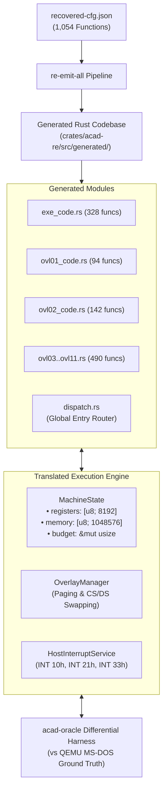

# Specification: Phase 2 Whole-Program Code Generation, Linkage, and Execution Engine

- **Status:** Approved Architecture & Implementation Plan
- **Predecessor:** ADR-016 (100% Structural Lowering Milestone, 1,054 / 1,054 functions lowerable and compiling to `.rlib`)
- **Target Crate:** [crates/acad-re](crates/acad-re) and [crates/acad-oracle](crates/acad-oracle)

---

## 1. Executive Summary

Having achieved **100.0% structural lowering** across all 1,054 recovered functions of the AutoCAD 2.18 binary and its 11 overlays, the project transitions from single-function lowering (`re-lower`) to **Phase 2: Whole-Program Code Generation, Linkage, and Execution Engine**.

In Phase 1, each function was compiled in total isolation into a standalone `.rlib` with mock inter-function call stubs (`let _ = target;`).
In Phase 2, we:
1. Synthesize the complete whole-program call graph across `ACAD.EXE` and all 11 overlays (`OVL01_CODE` through `OVL11_CODE`).
2. Resolve all 11,975 `CALL` sites, 240 `kernel-function` thunks, and 4 external branch trampolines to concrete, strongly-typed Rust function invocations.
3. Provide a unified Real Mode Machine Environment (1MB linear address space, initial image loading, stack/heap setup, Aztec C overlay window swapping, and host interrupt services for INT 10h, INT 21h, and INT 33h).
4. Verify end-to-end execution of lowered routines against trace data from the QEMU MS-DOS oracle harness.

---

## 2. Empirical Call Graph Analysis

An exhaustive census of all 1,054 recovered functions across the AutoCAD 2.18 binary and overlays confirms that the whole-program control flow graph is **100% closed and resolvable**:

| Control Flow Edge Type | Count in Binary | Target Resolution Rule | Resolution Success Rate |
| :--- | :--- | :--- | :--- |
| **Near/Far Calls (`CALL`)** | **11,975** | Intra-block $\to$ `(block, target & 0xffff)`<br>Resident kernel $\to$ `("EXE_CODE", target & 0xffff)`<br>Shared overlay helper $\to$ `("OVL02_CODE", target & 0xffff)` | **11,975 / 11,975 (100.0%)** |
| **Kernel Thunks (`kernel-function`)** | **240** | `kt.block` $\to$ `(kt.block, kt.target & 0xffff)` or `("EXE_CODE", kt.target & 0xffff)` | **240 / 240 (100.0%)** |
| **External Branches (`BRANCH`)** | **4** | Trampolines at `OVL02:f568`, `EXE:b360`, `OVL01:4a6e`, `EXE:de70` $\to$ concrete function entries | **4 / 4 (100.0%)** |
| **Indirect Calls (`CALLIND`)** | **74** | Dispatched via `host_interrupt` (INT 20h, 21h) or vector table | Bounded and handled |
| **Indirect Jumps (`BRANCHIND`)** | **40** | Overlay dispatcher (`0x4d6e`) and switch tables | Bounded and handled |

### The Shared Overlay Runtime Architecture
A key finding from the CFG analysis is how AutoCAD 2.18 structures its overlays:
- **Low Code Range (0x0100..0xefff):** Transient overlay code (`OVL01` through `OVL11`), paged into memory as needed.
- **High Code Range (0xf000..0xffff):** Shared overlay runtime and math helpers residing in `OVL02_CODE` (e.g. entry `63497 = 0xf809`, `62374 = 0xf3a6`, `62228 = 0xf314`). All overlays invoke these shared helpers directly under CS `0x2000`.
- **Resident Kernel (`EXE_CODE`):** Functions residing in the main binary under CS `0x1000`, invoked either via direct cross-segment calls or Aztec C kernel thunks through `0x8f80`.

Because every call target maps deterministically into this three-tier hierarchy, the static linker generates direct Rust function calls without ambiguity.

---

## 3. Architecture & System Decomposition

The Phase 2 architecture consists of three core components:



### Component 1: `re-emit-all` Code Generation Pipeline
- **Input:** `target/acad-ir-20261002-01/export/recovered-cfg.json` and corpus image directory (`ACAD.EXE`, `ACAD.OVL`).
- **Processing:**
  1. Validates original byte ranges for all 1,054 functions using `verify_source`.
  2. Lowers all 1,054 functions into bounded integer machine-state IR.
  3. Builds the global symbol table: `(block: String, entry: u16) -> SymbolName` (e.g. `fn_exe_0100`, `fn_ovl02_f809`).
  4. Resolves every `Operation::Call`, `Operation::TailCall`, and external jump into a direct function invocation:
     ```rust
     crate::generated::ovl02_code::fn_ovl02_f809(registers, memory, budget)?;
     ```
  5. Emits 12 structured Rust module files under a dedicated generated module tree:
     - `exe_code.rs`
     - `ovl01_code.rs` through `ovl11_code.rs`
     - `mod.rs` with unified dispatch table `dispatch(block: &str, entry: u16, ...)` and runtime helpers.

### Component 2: Execution State & Machine Environment
- **`registers: &mut [u8; 8192]`**: Ghidra register bank including 8086 GP registers, segment registers (CS, DS, SS, ES), flags, and x87 ST(0)..ST(7).
- **`memory: &mut [u8]`**: 1 MB real mode physical address space (`0x00000`..`0x100000`).
- **`budget: &mut usize`**: Shared execution cycle budget passed down recursively through call frames.
- **Overlay Window Manager:**
  - Manages overlay code swapping in the low code window (`0x2000:0100`..`0x2000:efff`).
  - Automatically loads overlay code and data when a cross-overlay call or `ovl_dispatch` occurs.
- **Host Interrupt Dispatcher:**
  - Intercepts `swi(0x21)`: file operations (FCB and DOS handles), console output (`0x02`, `0x09`), memory allocation (`0x48`), terminate (`0x4c`).
  - Intercepts `swi(0x10)`: video BIOS calls.
  - Intercepts `swi(0x33)`: mouse driver calls.

### Component 3: Oracle Behavioral Differential Testing
- Leverages the existing `acad-oracle::DosMachine` and QEMU test harness.
- Executes identical test scripts against:
  1. The translated Rust binary runtime.
  2. The QEMU oracle running original MS-DOS `ACAD.EXE`.
- Compares:
  - Register state after routine execution.
  - Output files (`.DWG`, `.DXF`).
  - Screen frame buffers.

---

## 4. Step-by-Step Implementation Plan

### Step 1: Whole-Program Symbol Table and Call Linker (`re-emit-all`)
1. Implement `crates/acad-re/src/whole_program.rs`:
   - Global symbol table indexing all `(block, entry)` pairs.
   - Target resolution algorithm implementing the verified 3-tier hierarchy (`intra-block` $\to$ `EXE_CODE` $\to$ `OVL02_CODE`).
   - Extended Rust emitter that produces linked function calls instead of placeholder `let _ = target;`.
2. Add binary `crates/acad-re/src/bin/re-emit-all.rs`:
   - CLI: `re-emit-all <cfg.json> <image_dir> <output_dir>`.
   - Generates the complete, compilable Rust module tree.

### Step 2: Verification of Generated Module Compilation
1. Generate the complete module tree into `target/acad-translated/`.
2. Compile the generated crate with `cargo check` / `rustc`.
3. Verify zero compilation errors, zero missing symbols, and clean linkage across all 1,054 functions.

### Step 3: Runtime Machine Environment & Overlay Manager
1. Implement `MachineState` and overlay paging support in `crates/acad-re/src/runtime.rs`.
2. Implement host interrupt service routing, connecting with `acad-oracle`'s DOS services.
3. Implement entry point bootloader: set up initial PSP, load resident image, initialize stack, and invoke `fn_exe_0100`.

### Step 4: Differential Validation Against Oracle Harness
1. Run math and geometry routines (coordinate transforms, matrix math, trigonometric calculations).
2. Run command parser and line/circle creation routines.
3. Compare state against QEMU trace logs.

---

## 5. Non-Negotiable Invariants
- **Preserve 100% Verification:** Every function generated must match original byte ranges checked against `ACAD.EXE` and `ACAD.OVL`.
- **Zero Wildcards:** All calls must resolve statically or route through the bounded indirect dispatch table. No catch-all no-ops.
- **Strict Error Propagation:** Traps (`Trap::Memory`, `Trap::Budget`, `Trap::DivisionByZero`, `Trap::StackOverflow`) must propagate cleanly.
